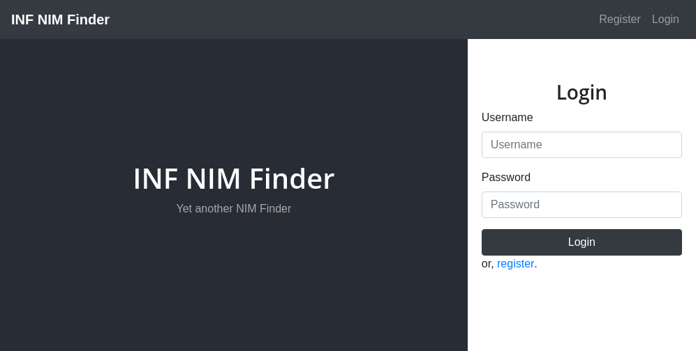
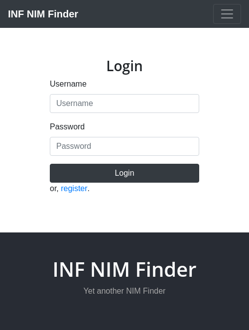
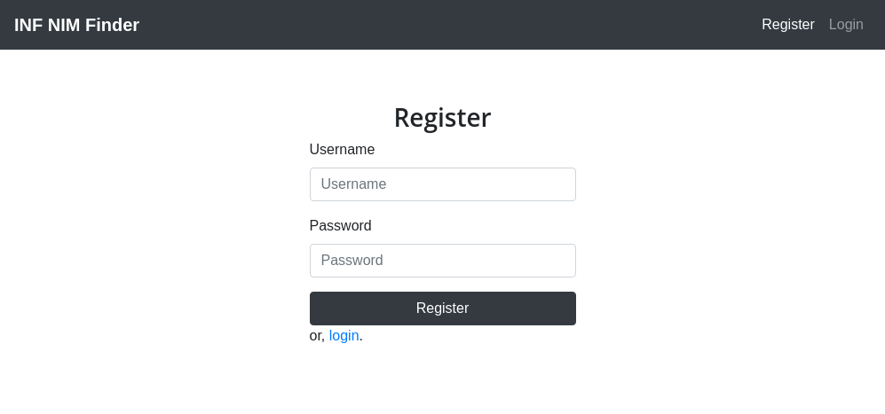
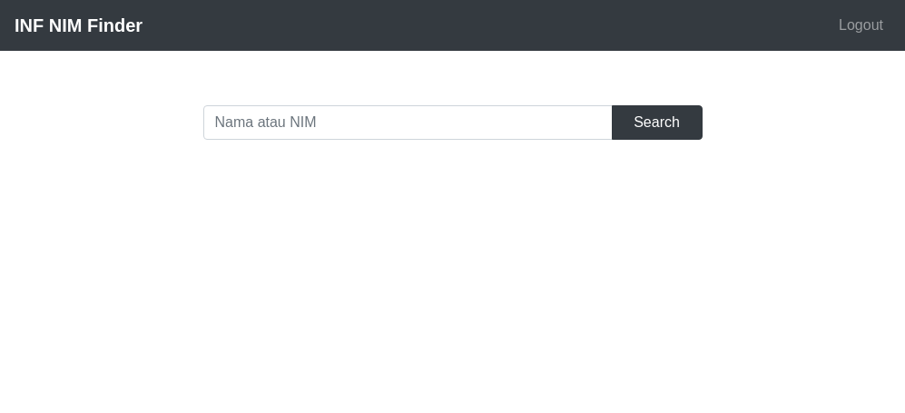
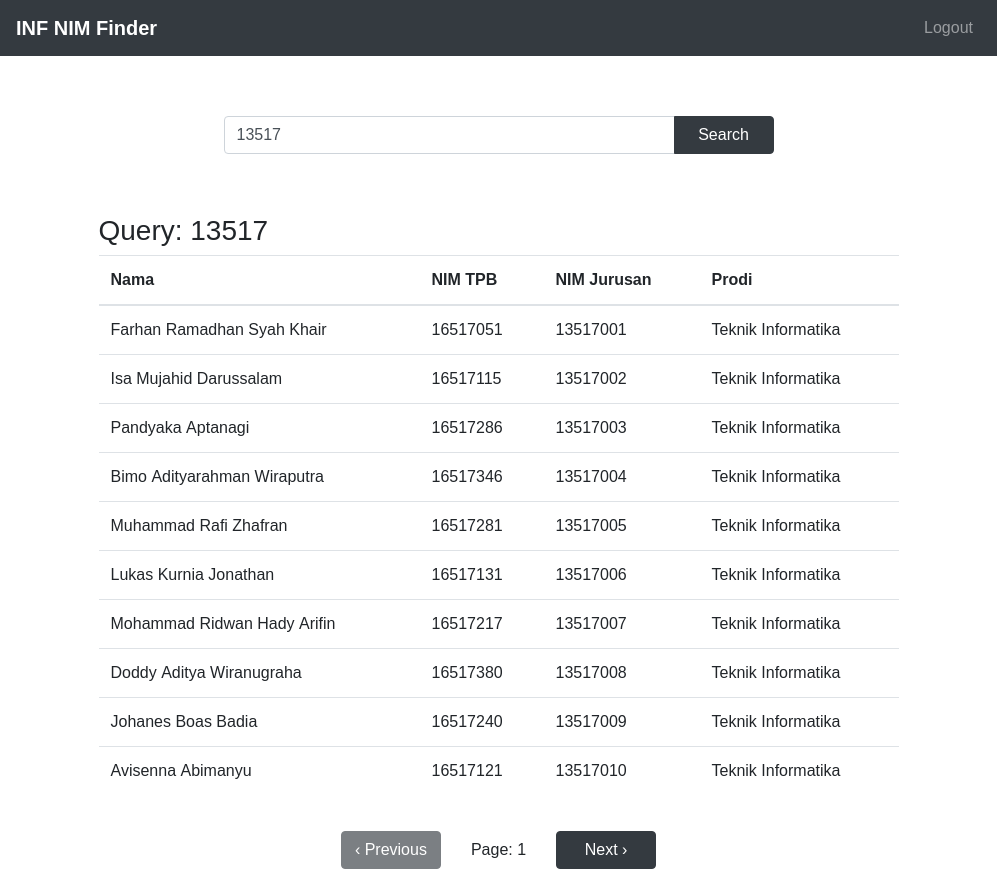
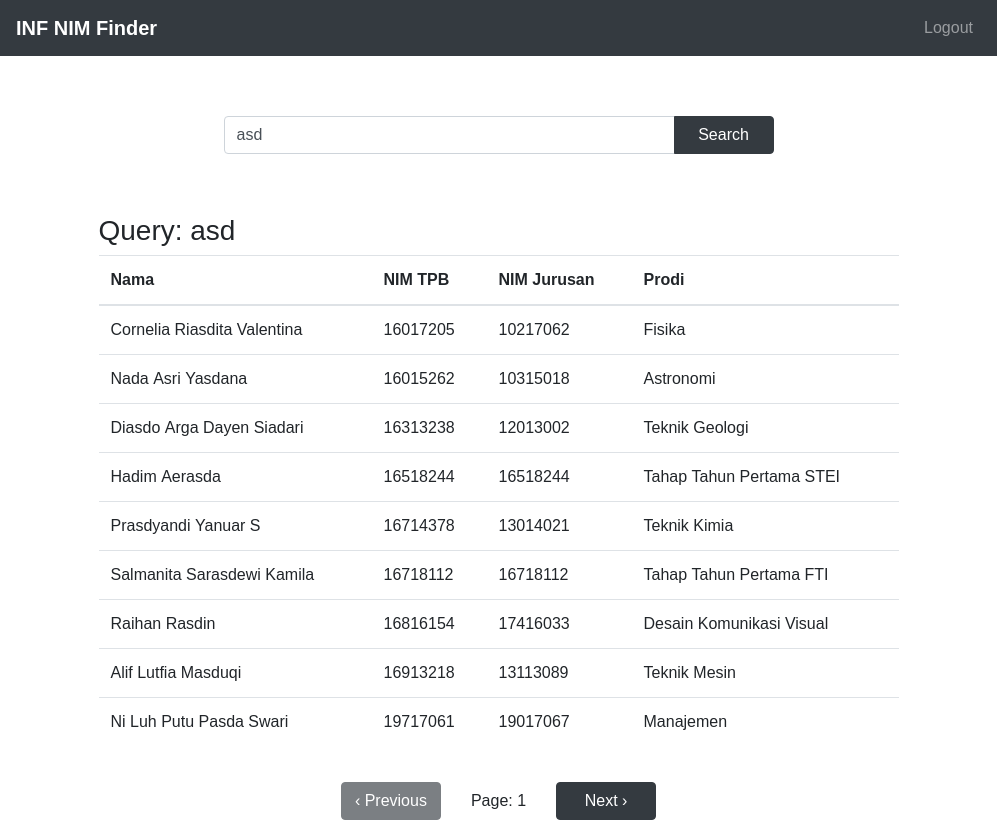
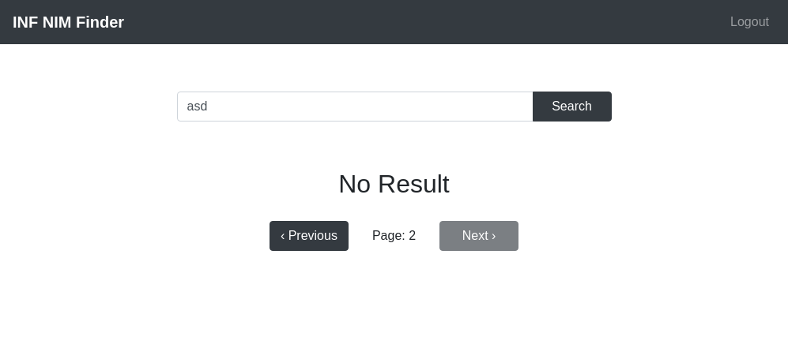
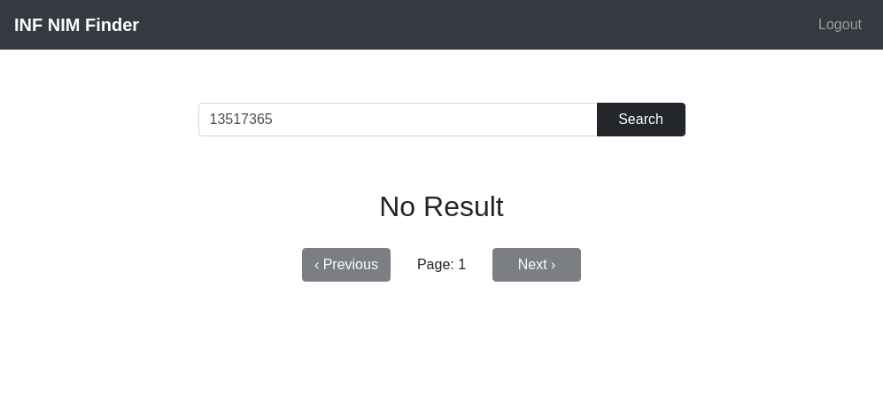

# INF NIM Finder

#### Nama : Stefanus Ardi Mulia

#### NIM : 13517119

## Petunjuk akses

Aplikasi ini dapat diakses di http://miner46er.github.io/INF-NIM-Finder

### Halaman Utama

Halaman utama berisi pesan pembuka serta form login bagi pengguna yang
belum login atau _session_-nya telah kadaluarsa.

Desktop:



Mobile:



Jika pengguna telah _login_, maka tampilan halaman utama menjadi halaman pencarian.

### Halaman Login

Halaman _login_ berisi form _login_ bagi pengguna.


Jika _login_ berhasil, pengguna akan dialihkan ke halaman pencarian.

Pengguna dapat _logout_ melalui menu _logout_ pada _navbar_.

### Halaman Register

Halaman _register_ berisi form _register_ bagi pengguna.



Jika registrasi berhasil, pengguna akan dialihkan ke halaman _login_.

### Halaman Pencarian

Halaman ini merupakan fitur utama dari aplikasi ini.

Halaman pencarian kosong berisi form query pencarian dan tombol cari.



Pencarian dapat dilakukan berdasarkan nama atau NIM.
Hasil pencarian akan ditampilkan di bawah _form_ _query_.

Pencarian berdasarkan NIM:


Pencarian berdasarkan nama:


Pengguna dapat melihat lembar lain dari hasil pencarian
dengan tombol navigasi di bawah hasil pencarian.

Jika pencarian tidak menghasilkan apa-apa atau lembar yang
diminta pengguna merupakan lembar terakhir (kosong), maka akan
ditampilkan pesan berikut.

Lembar terakhir (kosong):


Pencarian tanpa hasil:


## _Library_/kakas yang digunakan

- [npm](https://www.npmjs.com/)
- [React](https://reactjs.org/)
- [react-bootstrap](https://react-bootstrap.github.io/)
- [axios](https://github.com/axios/axios)
- [qs](https://github.com/ljharb/qs)
- [react-cookies](https://www.npmjs.com/package/react-cookies)
- [react-router-dom](https://reacttraining.com/react-router/)

## Langkah _Build_ Aplikasi

Install _dependency_ aplikasi ini dengan

```
npm install
```

lalu _build_ aplikasi dengan

```
npm run build
```

atau jalankan di `localhost`

```
npm start
```

Kamu juga dapat langsung membuat _github pages_ dengan

```
npm run deploy
```

## Desain aplikasi

Aplikasi ini dibuat menggunakan _framework_ React dan _stylesheet_ Bootstrap.

Data yang digunakan untuk pencarian didapatkan dari _endpoint_ API https://api.stya.net/nim dalam format JSON.

_Design pattern_ yang digunakan antara lain adalah:

- **_Chain of Responsibility_**

  _Chain of Responsibility_ merupakan _behavorial design pattern_ yang memungkinkan kita untuk meneruskan suatu _request_ melalui serangkaian _handler_. Setelah menerima suatu _request_, setiap _handler_ menentukan apakah akan memproses _request_ tersebut atau meneruskannya ke _handler_ berikutnya dalam rangkaian.

  _Design pattern_ ini digunakan dalam rendering _component_ yang dilakukan oleh _method_ `render` pada setiap _class component_ dan `return` dari setiap _functional component_.

### Penjelasan kelas-kelas

- **App**

  Kelas _controller_ utama dari aplikasi ini.
  Mengatur _state_ telah _login_ atau tidaknya pengguna.

- **Home**

  Mengatur halaman utama aplikasi ini.
  Menampilkan _landing page_ dan _login page_ jika pengguna belum melakukan _login_.
  Menampilkan _search page_ jika pengguna memiliki _session_ login.

- **MainNavbar**

  Menampilkan _navigation bar_ untuk menuju ke halaman utama, halaman _login_, atau halaman _register_.

- **Login**

  Menampilkan halaman bagi pengguna untuk _login_.
  Melakukan _request_ untuk _login_ ke API.

- **Register**

  Menampilkan halaman bagi pengguna untuk _register_.
  Melakukan _request_ untuk _register_ ke API.

- **Searchpage**

  Menampilkan dan menangani _query_ pencarian yang dilakukan oleh pengguna.
  Mengirimkan _request_ ke API dengan `count = 10`.

- **NotFound**

  Menampilkan pesan bahwa halaman ingin dikunjungi pengguna tidak ada.

## Review desain API

API yang digunakan (https://api.stya.net/nim) cukup lengkap mencakup kakas yang dibutuhkan untuk mencari data mahasiswa.

Namun salah satu hal yang menurut saya kurang adalah informasi mengenai banyaknya total data yang dihasilkan dari suatu query (misal jumlah mahasiswa dengan NIM parsial 13517) yang sangat dibutuhkan untuk mengetahui jumlah page total untuk paginasi.

Selain itu, lamanya batas waktu token sejak diterbitkan hingga kadaluarsa (1 hari) tergolong cukup lama dan dapat menyebabkan kerentanan yang dapat dieksploitasi oleh pihak tidak bertanggung jawab.
